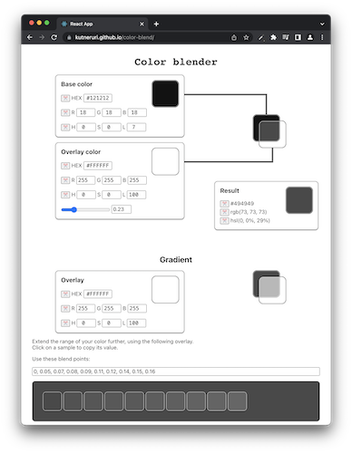
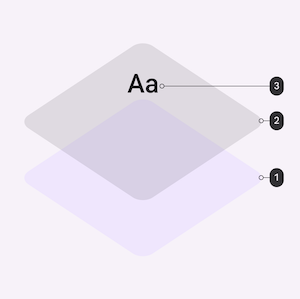

# Color blender

Looking for a tool to blend colors effortlessly? I've got you covered! Visit our [Color Blend Tool](https://kutneruri.github.io/color-blend/) and start creating your perfect color combinations!



## The Motivation

Material UI (MUI) has a unique color overlay system that layers colors to create a visual hierarchy.

It starts with a base layer (the primary color of the component), adds an overlay layer (a state or brand color), and tops it off with an content layer (known as the "ink" layer). The overlay color is semi-transparent, allowing the base color to shine through. This system creates a consistent visual hierarchy and ensures legibility.



However, MUI doesn't provide a built-in tool to blend these colors. While you could use a graphic design tool like Photoshop to do this, it's not the most efficient solution, especially if you're working directly with code.

## The Solution

I've made a simple site that does just that - blends two colors with opacity.

The tool also includes an opacity slider for the overlay, giving you full control over the blending effect.  
And that's not all! You can also create gradients using the resulting color and a second overlay, adding an extra layer of customization to your designs.

## Setting up the project

For local use, run these commands:

```
pnpm i
pnpm start
```

## Show Your Support

If you find this tool helpful, consider giving a star to this [repository](https://github.com/kutneruri/color-blend). Your support encourages me to keep improving and adding new features. Enjoy blending colors!
